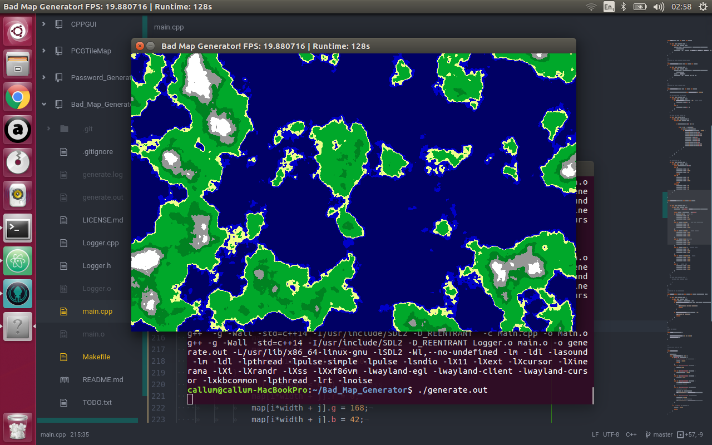
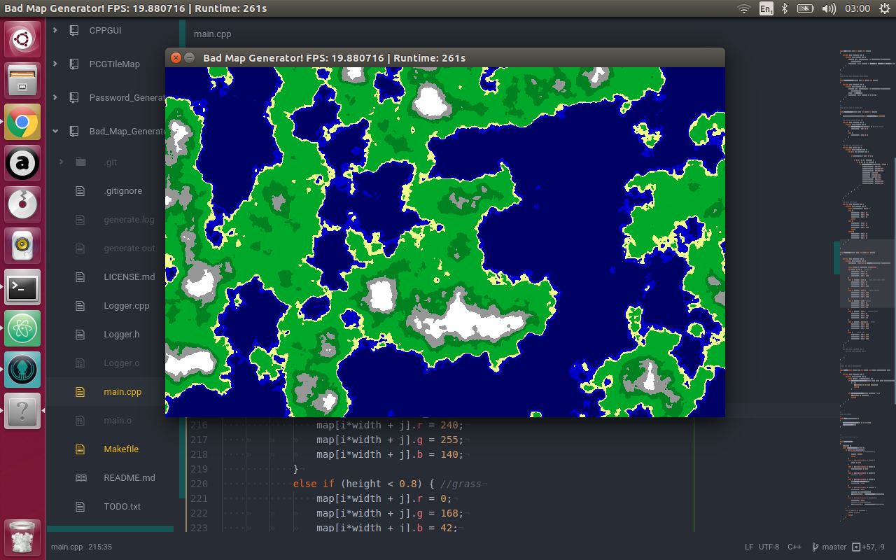

#Bad Map Generator
###A 2D top down map generator.
Uses SDL for drawing on the screen, getting user input, and timing.
#Usage
**ESC** Quit the application.  
**r** Fills map with random noise.  
**g** Fills map with greyscale noise.  
**m** Fills map with Lichen-looking stuff.  
**n** Fills map with a map generated with Perlin noise.  
**w** Writes the current map to Map.bmp and Color_Map.bmp. Color_Map.bmp is
in color, Map.bmp is greyscale.  
**Arrow Up** Increases frequency of perlin noise by 0.001 (Default is
0.004).  
**Arrow Down** Decreases frequency of perlin noise by 0.001 (default is
0.004).  
#Screenshots
####Basic maps using perlin noise

####Moving and zooming

